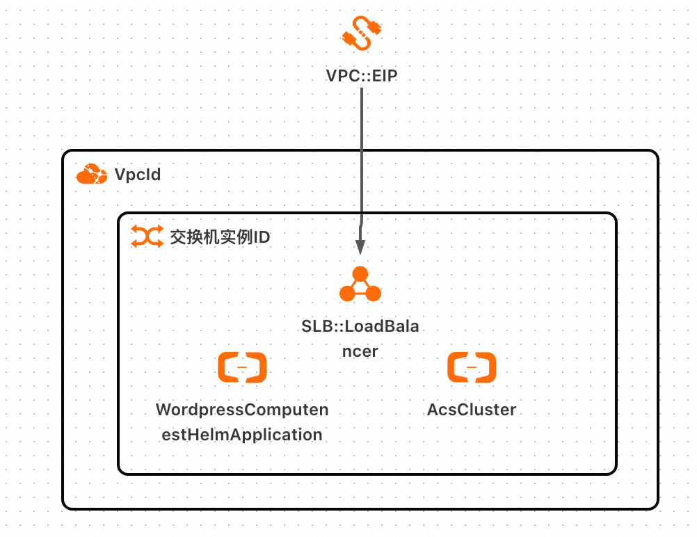
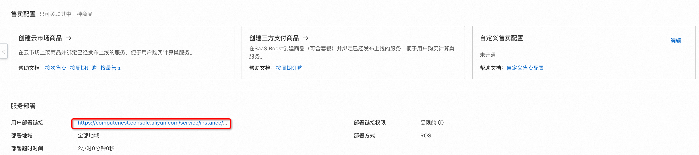
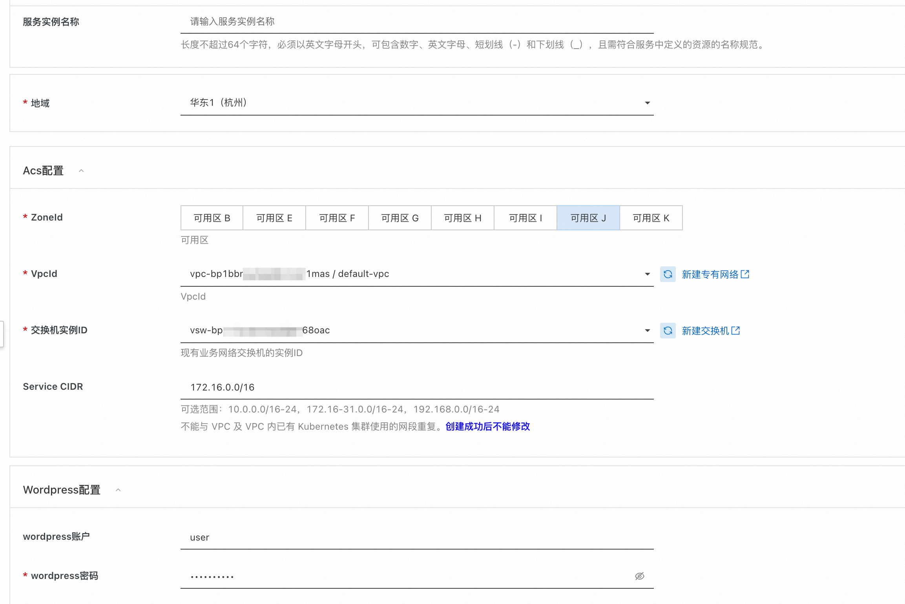
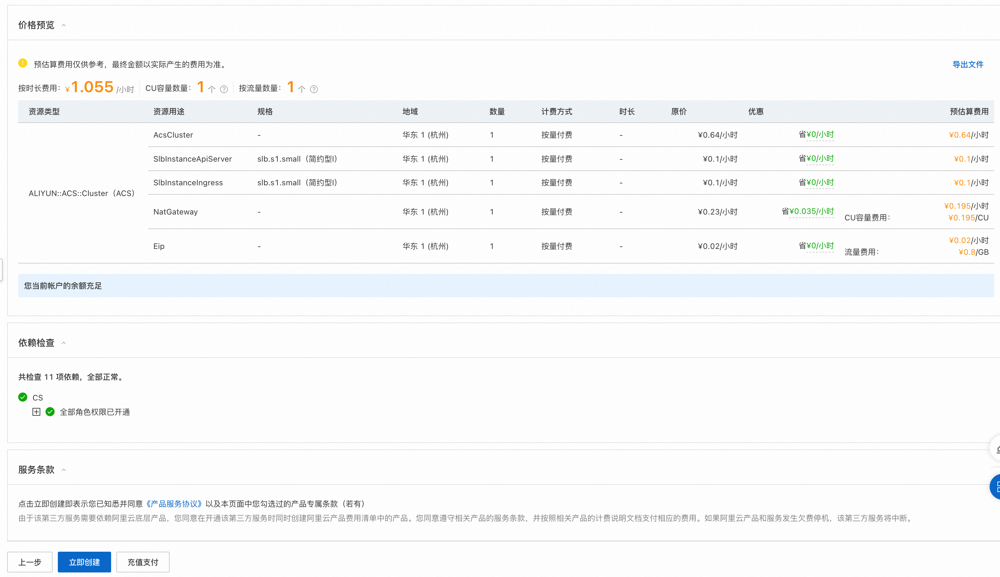
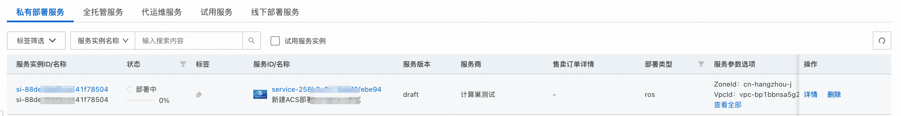
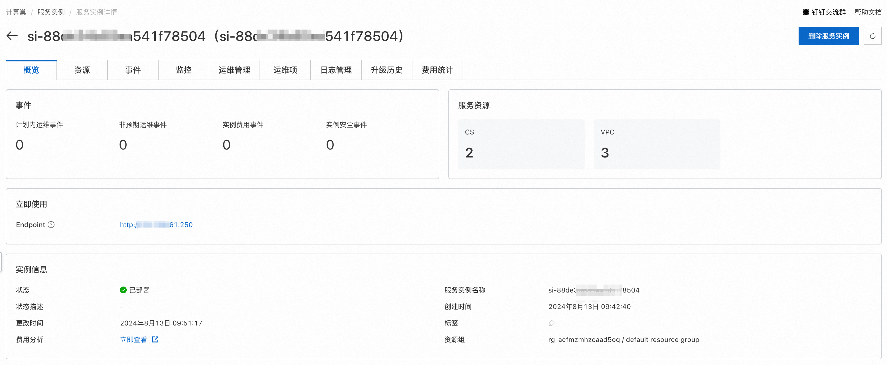
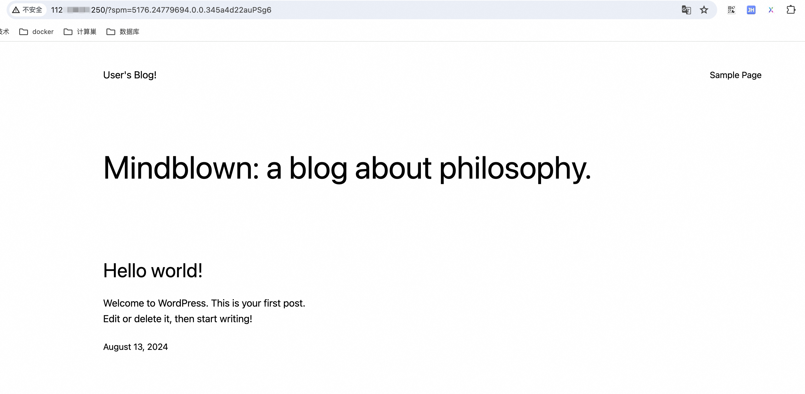
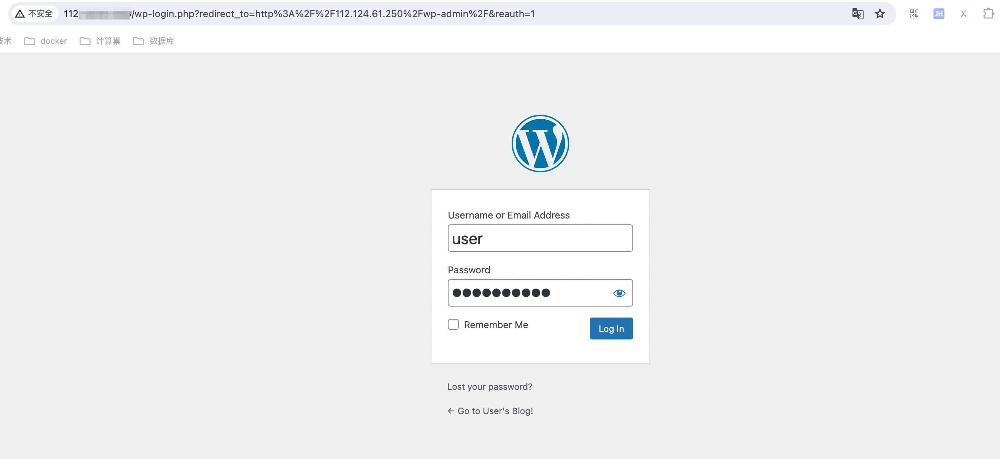

# 服务模板说明文档

## 服务说明

本文介绍wordpress服务acs+helm版快速上手流程，本示例对应的Git仓库地址：[wordpress-acs-helm-demo](https://github.com/aliyun-computenest/wordpress-acs-helm-demo)。

本示例会自动的构建计算巢服务，具体的服务构建流程为:

1. 将wordpress对应的helm chart压缩文件，上传到计算巢仓库中，生成计算巢helm部署物。
2. 通过ros模版创建计算巢服务，计算巢服务需要关联helm部署物。

创建过程大约持续1分钟，当服务变成待提交后构建成功。

## 服务架构

本部署架构为acs集群部署，将helm chart文件通过WordpressComputenestHelmApplication资源部署到acs集群中，通过service绑定的loadBalancer的公网ip进行访问，这个loadbalancer的创建由ack集群自动完成, 在本例中，service提供的对外端口为80，和容器对外提供的端口相同。



## 服务构建计费说明

测试本服务构建无需任何费用，创建服务实例涉及的费用参考服务实例计费说明。

## RAM账号所需权限

本服务需要对ACS、ECS、VPC等资源进行访问和创建操作，若您使用RAM用户创建服务实例，需要在创建服务实例前，对使用的RAM用户的账号添加相应资源的权限。添加RAM权限的详细操作，请参见[为RAM用户授权](https://help.aliyun.com/document_detail/121945.html)。所需权限如下表所示：

| 权限策略名称                          | 备注              |
|---------------------------------|-----------------|
| AliyunCSFullAccess             | 管理容器服务(CS)的权限    |
| AliyunECSFullAccess             | 管理云服务器服务（ECS）的权限 |
| AliyunVPCFullAccess             | 管理专有网络（VPC）的权限  |
| AliyunROSFullAccess             | 管理资源编排服务（ROS）的权限 |
| AliyunComputeNestUserFullAccess | 管理计算巢服务（ComputeNest）的用户侧权限 |
| AliyunComputeNestSupplierFullAccess | 管理计算巢服务（ComputeNest）的服务商侧权限 |


## 服务实例计费说明

测试本服务在计算巢上的费用主要涉及：

- acs集群部署pod所需vCPU、内存、磁盘费用
- 公网带宽

计费方式包括：

- 按量付费

预估费用在创建实例时可实时看到。

## 服务实例部署流程

### 部署参数说明

| 参数组         | 参数项            | 说明                                                        |
|-------------|----------------|-----------------------------------------------------------|
| 服务实例        | 服务实例名称         | 长度不超过64个字符，必须以英文字母开头，可包含数字、英文字母、短划线（-）和下划线（_）。            |
|             | 地域             | 服务实例部署的地域。                                                |                                                      |
| ACS配置       | 可用区            | ACS集群所在可用区。                                               |
|             | 专有网络VpcId      | 专有网络ID，不存在可新建。                                            |
|             | 交换机实例ID        | 交换机VSwitchId，对应专用网络（VPC）中的交换机，不存在可新建。。                    |
|             | Service CIDR   | ACS集群中service可用网段，不能与 VPC 及 VPC 内已有 Kubernetes 集群使用的网段重复。 |
| Wordpress配置 | wordpress用户名   | wordpress管理用户名，默认为user。                                   |。                                              |
|             | wordpress密码 | wordpress管理密码，需进行设置                                       |
### 部署步骤

0. 部署链接：
   
1. 单击部署链接，进入服务实例部署界面，根据界面提示，填写参数完成部署。
   
2. 参数填写完成后可以看到对应询价明细，确认参数后点击**下一步：确认订单**。
   
3.  确认订单完成后同意服务协议并点击**立即创建**，随后进入部署阶段。
   
4. 等待部署完成后就可以开始使用服务，进入服务实例详情点击visitUrl。
   
5. 访问visitUrl可以进入blog的首页，访问visitUrl/admin可以进入blog的后台管理页面：
   
   


## 服务详细说明

本文通过将部署wordpress服务需要的service、deployment等yaml文件打包成helm压缩包, 上传到计算巢仓库生成helm部署物，在模版中创建ACS集群，将helm部署物部署到ACS集群上。

### 部署物

helm部署物上传及关联配置在config.yaml中定义，Artifact_1为helm部署物定义，在DeployMetadata中定义了模版占位符{{ computenest::helmchart::wordpress }}与部署物的关联关系。
```
Service:
  DeployMetadata:
    SupplierDeployMetadata:
      HelmChartArtifactRelation:
        '{{ computenest::helmchart::wordpress }}':
          ArtifactId: ${Artifact.Artifact_1.ArtifactId}
          ArtifactVersion: ${Artifact.Artifact_1.ArtifactVersion}
Artifact:
  Artifact_1:
    ArtifactType: HelmChart
    ArtifactName: wordpress
    Description: wordpress HelmChart部署物
    ArtifactProperty:
      RepoName: ${HelmChartBuilder.HelmChart_1.RepoName}
      Tag: ${HelmChartBuilder.HelmChart_1.Tag}
HelmChartBuilder:
  HelmChart_1:
    HelmChartPath: 'resources/artifact_resources/helm_chart/wordpress-15.4.1.tgz'
    RepoName: wordpress
    Tag: 15.4.1
```

### 模版文件
ros_templates/template.yaml主要由三部分组成:

1.Parameters定义需要用户填写的参数，包括可用区、Acs集群配置、wordpress配置等参数。
```
Parameters:
  ZoneId:
    AssociationProperty: ZoneId
    Required: true
    Type: String
    Description:
      en: The zone ID.
      zh-cn: 可用区
  VpcId:
    AssociationProperty: ALIYUN::ECS::VPC::VPCId
    Type: String
    Description:
      en: VPC ID.
      zh-cn: VpcId
  VSwitchId:
    Type: String
    Label:
      en: VSwitch ID
      zh-cn: 交换机实例ID
    Description:
      en: Instance ID of existing business network switches, console-Virtual Private Cloud-VSwitches under query
      zh-cn: 现有业务网络交换机的实例ID
    AssociationProperty: ALIYUN::ECS::VSwitch::VSwitchId
    AssociationPropertyMetadata:
      VpcId: ${VpcId}
      ZoneId: ${ZoneId}
  ServiceCidr:
    Type: String
    Description:
      zh-cn: 可选范围：10.0.0.0/16-24，172.16-31.0.0/16-24，192.168.0.0/16-24<br>不能与 VPC 及 VPC 内已有 Kubernetes 集群使用的网段重复。<font color='blue'><b>创建成功后不能修改</b></font>
      en: 'Optional range: 10.0.0.0/16-24, 172.16-31.0.0/16-24, 192.168.0.0/16-24<br> cannot duplicate segments already used by existing Kubernetes clusters in VPC and VPC.<font color=''blue''><b>Cannot be modified after successful creation</b></font>'
    Label:
      zh-cn: Service CIDR
      en: Service CIDR
    AssociationProperty: ALIYUN::CS::ManagedKubernetesCluster::ServiceCidr
    Default: 172.16.0.0/16
  WordpressUsername:
    Type: String
    Label:
      zh-cn: wordpress账户
      en: wordpress username
    Default: user
  WordpressPassword:
    NoEcho: true
    Type: String
    Label:
      zh-cn: wordpress密码
      en: wordpress password
```

2.Resources定义需要开的资源，主要包括ACS集群和LoadBalancer资源。MODULE::ACS::ComputeNest::FluxOciHelmDeploy资源类型会将helm部署物部署到ACS集群中，其中{{ computenest::helmchart::wordpress }}是helm部署物占位符，会替换为对应的helm chart仓库地址。
```
Resources:
  AcsCluster:
    Type: ALIYUN::ACS::Cluster
    Properties:
      Name:
        Ref: ALIYUN::StackName
      VpcId:
        Ref: VpcId
      ServiceCidr:
        Ref: ServiceCidr
      ClusterSpec: ack.pro.small
      SnatEntry: true
      VSwitchIds:
        - Ref: VSwitchId
      ZoneId:
        Ref: ZoneId
      PodVSwitchIds:
        - Ref: VSwitchId
      ServiceDiscoveryTypes:
        - CoreDNS
  WordpressComputenestHelmApplication:
    Type: MODULE::ACS::ComputeNest::FluxOciHelmDeploy
    Version: v1
    Properties:
      ClusterId:
        Ref: ClusterId
      HelmChartUrl: '{{ computenest::helmchart::wordpress }}'
      DockerConfigJson: '{{ computenest::helm::dockerconfigjson }}'
      ChartValues:
        image:
          registry: compute-nest-registry.cn-hangzhou.cr.aliyuncs.com
          repository: bestpractice/wordpress
          tag: 6.2.0
        mariadb:
          image:
            registry: compute-nest-registry.cn-hangzhou.cr.aliyuncs.com
            repository: bestpractice/mariadb
            tag: 10.6.12
          primary:
            persistence:
              enabled: true
              storageClass: alicloud-disk-topology-alltype
              size: 20Gi
        persistence:
          enabled: false
        wordpressUsername:
          Ref: WordpressUsername
        wordpressPassword:
          Ref: WordpressPassword
      Namespace:
        Ref: 'ALIYUN::StackName'
      ReleaseName: wordpress
      WaitUntil:
        - Kind: Service
          Name: wordpress
          Namespace:
            Ref: ALIYUN::StackName
          JsonPath: $.status.loadBalancer.ingress[0].ip
          Operator: NotEmpty
          FirstMatch: true
          Timeout: 300
  # 获取service信息，输出到output中
  ClusterApplicationResources:
    Type: DATASOURCE::CS::ClusterApplicationResources
    DependsOn:
      - WordpressComputenestHelmApplication
    Properties:
      ClusterId:
        Ref: ClusterId
      Kind: Service
      Name: wordpress
      Namespace:
        Ref: ALIYUN::StackName
      JsonPath: $.status.loadBalancer.ingress[0].ip
      FirstMatch: true
```

3.Outputs定义需要最终在计算巢概览页中对用户展示的输出，展示wordpress的访问地址。
```
Outputs:
  # 将公网ip做为http返回的地址显示在控制台
  BlogPageUrl:
    Description:
      zh-cn: Blog页面url
      en: Blog Page URL
    Value:
      Fn::Sub:
        - "http://${ServerAddress}"
        - ServerAddress:
            Fn::GetAtt:
              - ClusterApplicationResources
              - Response
  BlogAdminUrl:
    Description:
      zh-cn: Blog后台url
      en: Blog Admin URL
    Value:
      Fn::Sub:
        - "http://${ServerAddress}/admin"
        - ServerAddress:
            Fn::GetAtt:
              - ClusterApplicationResources
              - Response
```