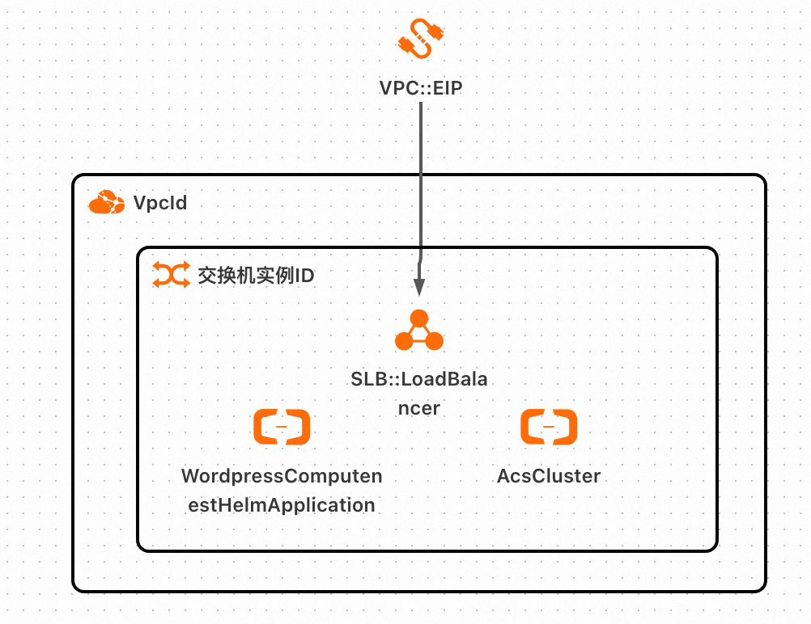
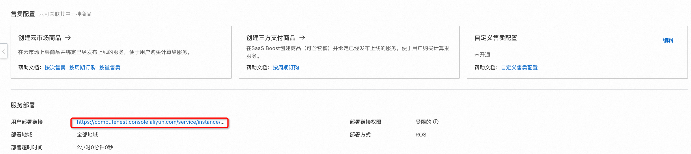
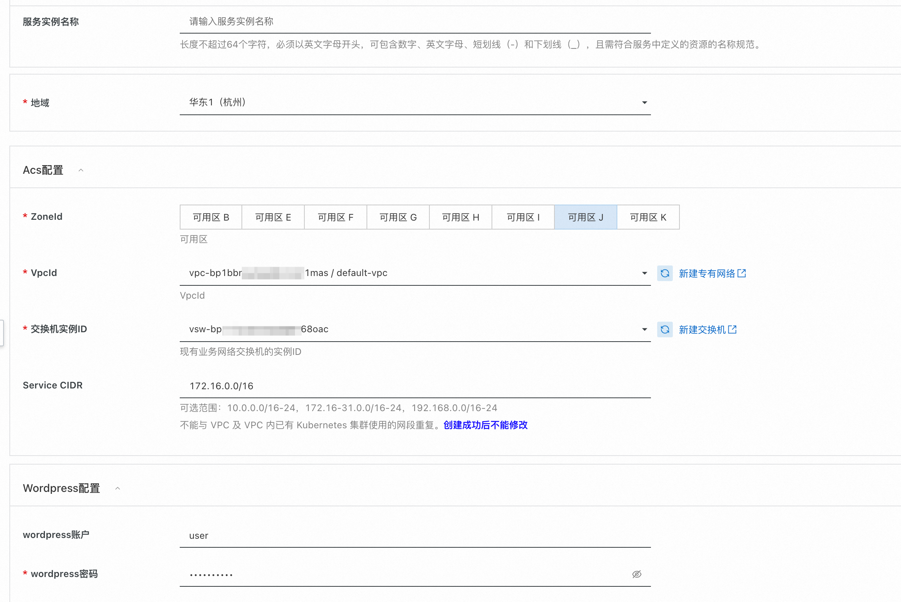
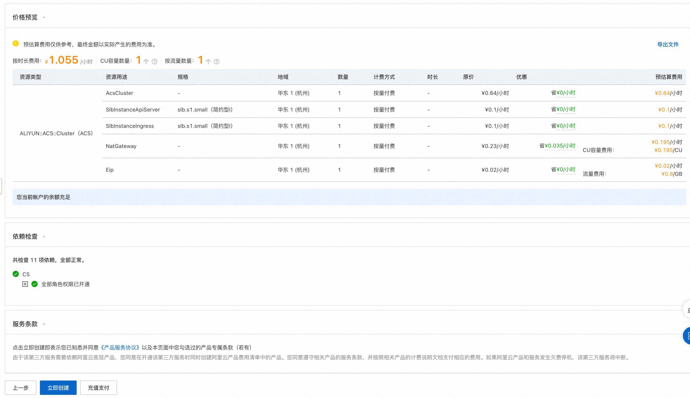
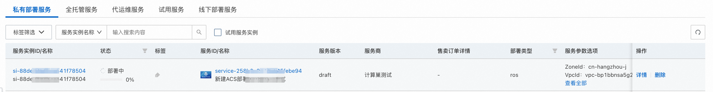
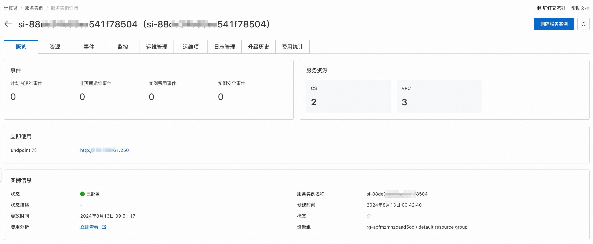
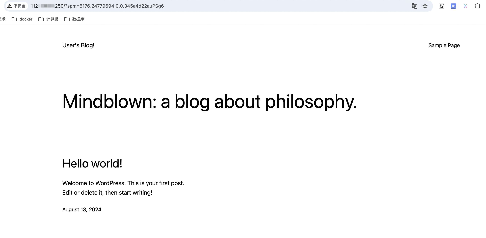
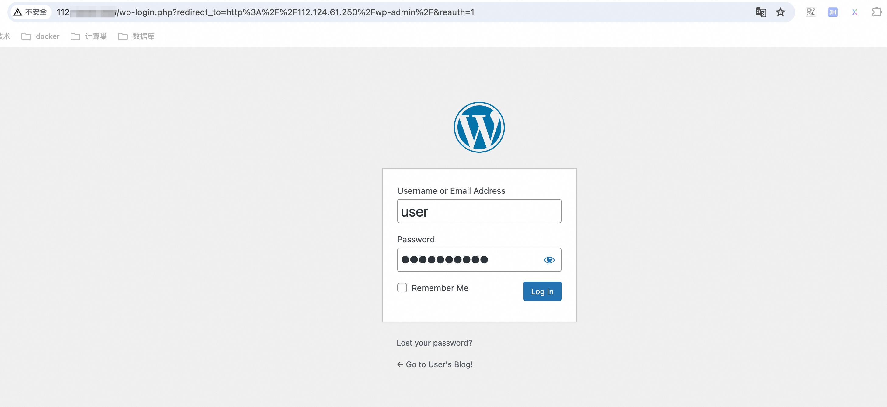

# 服务模板说明文档

## 服务说明

本文介绍wordpress服务acs+helm版快速上手流程，本示例对应的Git仓库地址：[wordpress-acs-helm-demo](https://github.com/aliyun-computenest/wordpress-acs-helm-demo)。

本示例会自动的构建计算巢服务，具体的服务构建流程为:

1. 将wordpress对应的helm chart压缩文件，上传到计算巢仓库中，生成计算巢helm部署物。
2. 通过ros模版创建计算巢服务，计算巢服务需要关联helm部署物。

创建过程大约持续1分钟，当服务变成待提交后构建成功。

## 服务架构

本部署架构为acs集群部署，将helm chart文件通过WordpressComputenestHelmApplication资源部署到acs集群中，通过service绑定的loadBalancer的公网ip进行访问，这个loadbalancer的创建由ack集群自动完成, 在本例中，service提供的对外端口为80，和容器对外提供的端口相同。

## 服务构建计费说明

测试本服务构建无需任何费用，创建服务实例涉及的费用参考服务实例计费说明。

## 服务实例部署流程

### 部署步骤

0. 部署链接：
   
1. 单击部署链接，进入服务实例部署界面，根据界面提示，填写参数完成部署。
   
2. 参数填写完成后可以看到对应询价明细，确认参数后点击**下一步：确认订单**。
   
3.  确认订单完成后同意服务协议并点击**立即创建**，随后进入部署阶段。
   
4. 等待部署完成后就可以开始使用服务，进入服务实例详情点击visitUrl。
   
5. 访问visitUrl可以进入blog的首页，访问visitUrl/admin可以进入blog的后台管理页面：
   
   

## 服务详细说明

本文通过将部署wordpress服务需要的service、deployment等yaml文件打包成helm压缩包, 上传到计算巢仓库生成helm部署物，在模版中创建ACS集群，将helm部署物部署到ACS集群上。

### 模版文件
ros_templates/template.yaml主要由三部分组成:

1.Parameters定义需要用户填写的参数，包括可用区、Acs集群配置、wordpress配置等参数。
2.Resources定义需要开的资源，主要包括ACS集群和LoadBalancer资源。MODULE::ACS::ComputeNest::FluxOciHelmDeploy资源类型会将helm部署物部署到ACS集群中，其中{{ computenest::helmchart::wordpress }}是helm部署物占位符，会替换为对应的helm chart仓库地址。
3.Outputs定义需要最终在计算巢概览页中对用户展示的输出，展示wordpress的访问地址。